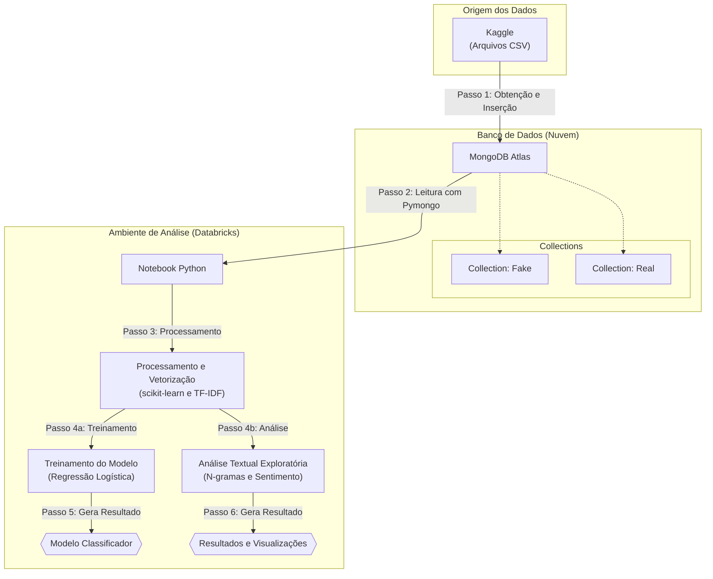

-----

# Detecção de Fake News com Processamento em Larga Escala Utilizando MongoDB Atlas e Python

## Conceito do projeto

O projeto tem como foco o desenvolvimento de um pipeline completo para a detecção automática de fake news, integrando tecnologias de armazenamento e processamento de dados. Utilizando o **MongoDB Atlas** como banco de dados NoSQL e a biblioteca **Pymongo** em um ambiente **Databricks** para a análise e processamento, o sistema é capaz de armazenar, transformar e analisar milhares de notícias jornalísticas.

Nosso objetivo é demonstrar a aplicação de tecnologias NoSQL e frameworks de processamento para:

  * Armazenar de forma flexível e escalável um volume significativo de notícias.
  * Processar dados textuais em larga escala utilizando técnicas de NLP (*Natural Language Processing*).
  * Treinar e avaliar um modelo de *machine learning* para classificar notícias.
  * Avaliar a viabilidade da arquitetura proposta no contexto de aplicações robustas.
  * Identificar padrões linguísticos, como as palavras mais frequentes em textos de *fake news*.

## Pré-requisitos e recursos utilizados

**Linguagens e Bibliotecas:**

  * **Python 3.x**
  * **Pymongo:** Para interação direta com o MongoDB Atlas.
  * **Pandas:** Para manipulação e análise de dados.
  * **Scikit-learn:** Para pré-processamento, vetorização (TF-IDF) e treinamento do modelos.
  * **NLTK:** Para processamento de linguagem natural (stopwords).
  * **Matplotlib / Seaborn:** Para visualização de dados e geração de gráficos.

**Infraestrutura e Plataformas:**

  * **MongoDB Atlas:** Banco de dados NoSQL na nuvem para armazenamento dos artigos.
  * **Databricks:** Plataforma utilizada para a execução dos notebooks de análise em Python.

**Fonte de Dados:**

  * **Fake and Real News Dataset – Kaggle:** O conjunto de dados original, contendo aproximadamente 44.000 artigos, foi utilizado como base.
      * Disponível em: [Fake and Real News Dataset](https://www.kaggle.com/datasets/clmentbisaillon/fake-and-real-news-dataset)

## Passo a passo

O projeto foi estruturado seguindo um pipeline claro de processamento de dados, desde a coleta até a análise e avaliação do modelo.

1.  **Obtenção dos Dados**: Download dos arquivos `Fake.csv` e `True.csv` a partir da fonte de dados no Kaggle.
2.  **Ingestão no Banco de Dados**: Cada notícia foi convertida para o formato JSON e inserida em uma *collection* específica (`Fake` ou `Real`) no cluster do MongoDB Atlas.
3.  **Conexão e Leitura**: Utilizando um notebook no ambiente Databricks, estabelecemos a conexão com o MongoDB Atlas via `Pymongo` e carregamos os dados para análise.
4.  **Processamento e Vetorização**: Os textos foram processados com técnicas de NLP (limpeza, tokenização, remoção de stopwords) e transformados em vetores numéricos com a técnica **TF-IDF**.
5.  **Treinamento do Modelo**: Um modelo de classificação de **Regressão Logística** foi treinado com os dados vetorizados para distinguir entre notícias falsas e verdadeiras.
6.  **Análise e Avaliação**: Foram realizadas análises exploratórias para identificar padrões linguísticos (palavras mais frequentes, n-gramas, análise de sentimento) e o modelo foi avaliado quanto à sua acurácia e outras métricas de desempenho.

### Fluxograma do Pipeline



## Instalação

Para replicar o ambiente do projeto, siga os passos abaixo:

1.  **Clone o repositório:**
    ```bash
    git clone https://github.com/guilherme-bortoletto/fake-news.git
    cd fake-news
    ```
2.  **Crie e ative um ambiente virtual:**
    ```bash
    python -m venv venv
    source venv/bin/activate  # No Windows: venv\Scripts\activate
    ```
3.  **Instale as dependências:**
    ```bash
    pip install pymongo pandas scikit-learn nltk matplotlib seaborn jupyter
    ```
4.  **Configure o MongoDB Atlas:**
      * Crie um cluster gratuito no [MongoDB Atlas](https://www.mongodb.com/cloud/atlas).
      * Crie um banco de dados (ex: `Fake_and_Real`) e duas collections (ex: `Fake` e `Real`).
      * Obtenha a **URI de conexão** e substitua no script de análise.
5.  **Carregue os dados:** Execute um script para ler os arquivos `Fake.csv` e `True.csv` e inseri-los nas *collections* correspondentes no MongoDB Atlas.

## Execução

1.  Abra o notebook de análise (arquivo `.ipynb`) no ambiente de sua preferência (Jupyter, VS Code ou Databricks).
2.  Assegure-se de que a URI de conexão com o MongoDB Atlas está corretamente configurada no código:
    ```python
    from pymongo import MongoClient

    # Substitua pela sua URI de conexão
    conn_uri = "mongodb+srv://<user>:<password>@cluster.mongodb.net/?retryWrites=true&w=majority"
    client = MongoClient(conn_uri)
    db = client["Fake_and_Real"]
    ```
3.  Execute as células do notebook sequencialmente para realizar a leitura dos dados, o pré-processamento, o treinamento do modelo e a visualização dos resultados.

## Bugs/problemas conhecidos

  * **Mudança de Estratégia de Processamento:** O plano inicial era utilizar **PySpark** no Databricks para o processamento distribuído. Contudo, devido a limitações da versão **Databricks Community Edition**, que removeu o acesso a clusters computacionais em seu plano gratuito, o conector `spark-mongodb` tornou-se inviável. Como solução, o projeto foi adaptado para usar a biblioteca **Pymongo** para interação direta com o MongoDB, mantendo a integridade do pipeline, embora sem o processamento distribuído do Spark.

## Autores

  * **Vinicius Silva Castro** – 802138
  * **Guilherme Campos Bortoletto** – 801477


--
## Análise Detalhada e Resultados

Nesta fase, o desempenho do modelo de classificação foi rigorosamente avaliado e uma análise quantitativa aprofundada foi realizada para extrair padrões linguísticos e estatísticos dos textos.

### Avaliação de Desempenho do Modelo (Regressão Logística)

Para este projeto, foram testados diferentes modelos de classificação para a tarefa de detecção de fake news. Dentre as abordagens avaliadas, o modelo de Regressão Logística foi o que apresentou a melhor performance, demonstrando uma capacidade excepcional de distinguir entre os textos com uma acurácia de 99% no conjunto de teste, além de métricas de precisão e recall quase perfeitas para ambas as classes.

#### Relatório de Classificação:

```
              precision    recall  f1-score   support

           0       0.99      0.99      0.99      4733
           1       0.99      0.99      0.99      4247

    accuracy                           0.99      8980
   macro avg       0.99      0.99      0.99      8980
weighted avg       0.99      0.99      0.99      8980
```

#### Matriz de Confusão:

A matriz de confusão abaixo detalha os acertos e erros do modelo, onde a classe `0` representa notícias falsas e a `1`, notícias verdadeiras.

```
[[4684   49]
 [  51 4196]]
```

|                         | **Previsto: Falso (0)** | **Previsto: Real (1)** |
|:------------------------|:-----------------------:|:------------------------:|
| **Verdadeiro: Falso (0)** | 4684 ✅ (Verdadeiro Negativo - TN) | 49 ❌ (Falso Positivo - FP) |
| **Verdadeiro: Real (1)** | 51 ❌ (Falso Negativo - FN)       | 4196 ✅ (Verdadeiro Positivo - TP) |

##### 🧠 Interpretação:

  - O modelo classificou corretamente **4684** notícias falsas e **4196** notícias verdadeiras.
  - Os erros foram mínimos: apenas **49** notícias verdadeiras foram classificadas como falsas (falsos positivos) e **51** notícias falsas foram consideradas verdadeiras (falsos negativos).
  - Essa alta taxa de acerto confirma que o modelo de Regressão Logística é extremamente eficaz e robusto para este problema.

### Análise Quantitativa e Linguística

#### 1\. Palavras Mais Frequentes por Classe

A análise das palavras mais frequentes revela padrões linguísticos distintos. Nas fake news, termos como "hillary", "clinton", "obama" e "trump" dominam o vocabulário, indicando um forte viés político e a utilização de figuras polarizadoras. Palavras como "us", "president" e "people" sugerem um foco em temas nacionais, frequentemente associados a teorias da conspiração. Além disso, o uso de termos como "would", "even" e "like" aponta para um tom mais hipotético e emocional.

Por outro lado, as notícias reais apresentam um perfil mais neutro e factual. Termos como "washington", "united", "states" e "government" refletem uma abordagem mais institucional. Expressões como "told", "could" e "house" indicam um discurso mais descritivo e menos carregado de emoção. Embora "trump" e "president" também apareçam, seu uso é menos dominante e mais contextualizado.

#### 2\. Nuvem de Palavras (Word Cloud)

As nuvens de palavras reforçam e complementam os padrões identificados. Na nuvem das **fake news**, destacam-se visualmente termos como "Trump", "Hillary" e "Clinton", confirmando o foco em figuras políticas. A presença marcante desses nomes sugere que as fake news se aproveitam de sua notoriedade para atrair atenção. Em contraste, a nuvem das **notícias reais** apresenta um vocabulário mais diversificado, com termos como "Washington", "United", "States" e "government" predominando, o que reflete uma abordagem mais institucional e factual.

#### 3\. Distribuição de Tamanho dos Textos

A análise da distribuição do tamanho dos textos (em caracteres) mostra que a maioria se concentra na faixa de 0 a 5.000 caracteres. Observa-se um pico em torno de 2.000 caracteres, com a curva de textos falsos (`label 0`) ligeiramente mais alta nessa região, o que sugere que esses textos tendem a ser um pouco mais curtos. Apesar dessas diferenças sutis, as distribuições são bastante semelhantes, indicando que o tamanho, isoladamente, pode não ser um fator decisivo para a diferenciação.

#### 4\. Frequência de Bigramas (Pares de Palavras)

A análise de bigramas revela diferenças marcantes. Nos conteúdos falsos, observa-se uma predominância de combinações envolvendo figuras políticas, como "donald trump" e "hillary clinton". Este padrão sugere uma estratégia de associar a desinformação a personalidades já carregadas de significado político. Em contraste, as notícias reais apresentam uma estrutura mais convencional. Bigramas como "trump said" seguem o padrão profissional de atribuição de fontes, enquanto combinações como "prime minister" e "north korea" demonstram uma cobertura mais ampla de temas internacionais.

#### 5\. Frequência de Trigramas (Trios de Palavras)

A análise de trigramas revela padrões ainda mais distintos. Nos conteúdos falsos, destacam-se estruturas que combinam termos institucionais com alegações não verificadas, como "century wire says". A presença marcante de "president barack obama" e "president donald trump" indica a apropriação de cargos para dar aparência de legitimidade. Notícias reais, por outro lado, apresentam trigramas que refletem práticas jornalísticas convencionais, como "white house said" e "secretary state rex", demonstrando preocupação com a atribuição precisa de declarações.

#### 6\. Análise de Sentimento

O gráfico de boxplot mostra a distribuição dos escores de sentimento, variando de -1.0 (negativo) a +1.0 (positivo). As medianas de ambas as classes estão próximas de 0.0, sugerindo que os textos, em média, tendem ao sentimento neutro. No entanto, a classe **Fake** (vermelha) exibe uma dispersão ligeiramente maior de sentimentos negativos, com alguns outliers em extremos negativos. Isso pode indicar que textos falsos, em certos casos, carregam uma carga emocional mais negativa, o que pode ser uma feature útil para a detecção.

#### 7\. Análise de Features de Comprimento

Os dados revelam padrões sutis na estrutura textual. Em média, os textos classificados como fake news apresentam uma extensão ligeiramente maior, tanto em caracteres quanto em palavras. Esses resultados sugerem que conteúdos falsos podem adotar estratégias de maior detalhamento ou repetição para reforçar suas narrativas.

| Classe | Média de Caracteres (text\_length) | Média de Palavras (word\_count) |
|:---|:---:|:---:|
| **Fake News (0)** | 1740.86 | 230.74 |
| **Notícias Reais (1)** | 1719.16 | 226.66 |

## Conclusão

Este trabalho realizou uma análise detalhada de fake news utilizando uma infraestrutura tecnológica eficiente composta por MongoDB Atlas, PyMongo e Databricks. Essa combinação mostrou-se ideal para todo o fluxo de trabalho, desde o armazenamento flexível dos dados em formato JSON até a execução otimizada das análises textuais e estatísticas.

A arquitetura provou-se escalável e flexível, permitindo adaptar a estrutura dos dados conforme novas necessidades surgiam. A análise linguística forneceu evidências robustas sobre as assinaturas da desinformação, como o uso excessivo de nomes de figuras públicas, tom emocional e ausência de fontes atribuídas. O modelo preditivo, baseado nessas características, alcançou um desempenho excelente, validando a eficácia da abordagem.

Os resultados sugerem que a combinação dessas features pode servir como base para sistemas de classificação automática mais sofisticados. Para o público geral, estes achados oferecem indicadores práticos para a identificação de conteúdo suspeito. Como próximos passos, sugere-se a integração dessas descobertas em modelos mais avançados e a criação de materiais educativos que traduzam esses padrões em orientações acessíveis.

## Demais anotações e referências

1.  **MongoDB Atlas e Integração com Python (PyMongo)**
    MongoDB, Inc. (2024). *A Guide to Connect Databricks and MongoDB Atlas using Python API*. CloudThat.
    Disponível em: [https://www.cloudthat.com/resources/blog/a-guide-to-connect-databricks-and-mongodb-atlas-using-python-api](https://www.cloudthat.com/resources/blog/a-guide-to-connect-databricks-and-mongodb-atlas-using-python-api)

2.  **Databricks e Processamento de Dados com MongoDB Atlas**
    Raisinghani, A. (2024). *Utilizing PySpark to Connect MongoDB Atlas with Azure Databricks*. MongoDB Developer Center.
    Disponível em: [https://www.mongodb.com/developer/languages/python/atlas-databricks-pyspark-demo](https://www.mongodb.com/developer/languages/python/atlas-databricks-pyspark-demo)

3.  **Documentação Oficial do PyMongo**
    MongoDB, Inc. (2025). *PyMongo Documentation*.
    Disponível em: [https://pymongo.readthedocs.io](https://pymongo.readthedocs.io)

4.  **Documentação Oficial do Databricks**
    Databricks, Inc. (2025). *Databricks Documentation*.
    Disponível em: [https://docs.databricks.com](https://docs.databricks.com)